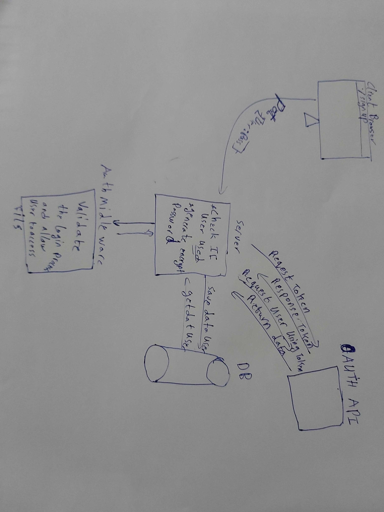

# lab-12-2

# LAB - 12

<!-- ## Project: Project Name Here -->
## OAuth Server

### Author: Abdallah Obaid

### Links and Resources

* [submission PR](https://github.com/Abdallah-401-advanced-javascript/auth-server/pull/2)
* [travis](https://github.com/Abdallah-401-advanced-javascript/auth-server/pull/2/checks?check_run_id=752039499)
* [ci/cd](https://github.com/Abdallah-401-advanced-javascript/auth-server/pull/2/checks?check_run_id=752040894)

### Documentation

### Modules
#### `linkedin` 
##### Exported Values and Methods

###### `node index.js `
This will start listening.
###### `linkedin`
This will make an authorization for the client from third-party.

### Setup

#### `.env` requirements 
PORT=3000
TOKEN_SERVER=https://www.linkedin.com/oauth/v2/accessToken
REMOTE_API=https://api.linkedin.com/v2/jobs/
CLIENT_ID=77wcte95rcnlli
CLIENT_SECRET=9AaNf9bPnHW2bzyu
API_SERVER=https://localhost:3000/oauth

#### How to initialize/run your application 

* `npm init -y`
*  use git,postman or sawgger to use crud methods.

#### How to use your library (where applicable)
<!-- * use const lib=require('lib') -->
const users = require('../linkedin');

#### Tests

* Unit Tests: `npm test`
* Lint Tests: `npm run lint`

<!-- Incomplete Tests: -->

#### UML

